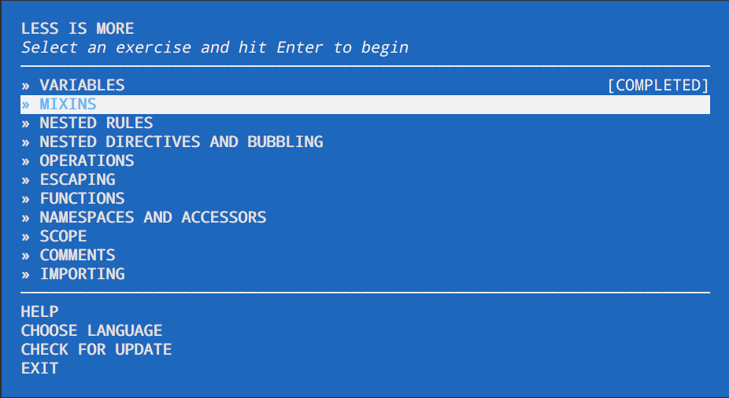

# LESS is more

Teach yourself the basics of LESS through simple coding exercises. Based on the node [workshopper](https://www.npmjs.com/package/workshopper) adventure format popularized by [NodeSchool](https://nodeschool.io).

This adventure is inspired by the [LESS language features documentation](http://lesscss.org/features/)

## Get help
Having issues with `less-is-more`? Get help troubleshooting in the [nodeschool discussions repo](http://github.com/nodeschool/discussions).


## Install Node.js

Make sure Node.js is installed on your computer.

Install it from [nodejs.org/download](http://nodejs.org/download)

### Install `less-is-more` with `npm`

Open your terminal and run this command:

```bash
npm install -g less-is-more
```

The `-g` or `--global` option installs this module globally so that you can run it as a command in your terminal.

#### Having issues with installation?

If you get an `EACCESS` error, the simplest way to fix this is to rerun the command, prefixed with sudo:

```bash
sudo npm install -g less-is-more
```

You can also fix the permissions so that you don't have to use `sudo`. Have a look at the [npm documentation](https://docs.npmjs.com/getting-started/fixing-npm-permissions).

## Run the workshop

Open your terminal and run the following command:

```bash
less-is-more
```

You'll see the menu:



1. Navigate the menu with the up & down arrow keys.
1. Choose a challenge by hitting enter.

# Acknowledgements

Thanks to [Claudio Procida](https://github.com/claudiopro) for the [learn-sass](https://github.com/claudiopro/learn-sass) adventure and [Lin Clark](https://github.com/linclark) for the [demo-workshopper](https://github.com/linclark/demo-workshopper) repo.

# License

[MIT](http://opensource.org/licenses/MIT)
